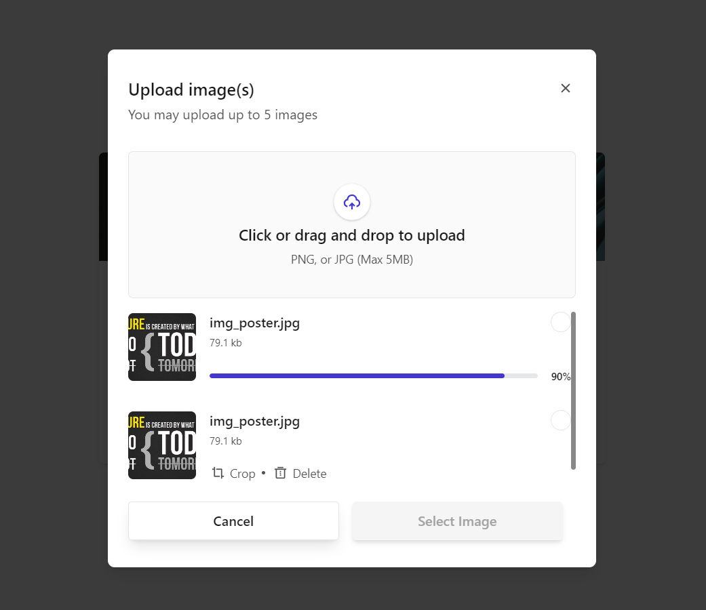

# Image Uploader Application

A React.js and Node.js application for smooth image uploading, including drag-and-drop, image management, and robust error handling.

 

**Figma Design:** 
```bash
https://www.figma.com/design/tAekIi9QG7AVxP9NGxkNYb/image-uploader-figma?node-id=0-1&t=mH62885eeSkaIzEr-1
```
**Demo Video:** 
```bash
https://drive.google.com/file/d/1qi80iWpQLJv-E29Ii5FtRwYpso1J-QsK/view?usp=sharing
```
--- 

## Key Concepts

- Image Uploads (Single/Multiple)
- Drag-and-Drop
- Image Management (Crop, Delete)
- Progress/Error Handling
- API Integration

## Functional Requirements

1. **Profile Picture Interface**: Display or update profile picture.
2. **Image Upload Interface**: Drag-and-drop or select images, handle errors.
3. **Progress/Error Handling**: Show upload progress, handle errors.
4. **Image Management**: Crop, delete, and select profile picture.
5. **Saving Preferences & Fetching Data**: API endpoints for image data.
6. **Error States**: Manage data fetch errors.

## How to use

1. **Start the Backend Server**:
   - Navigate to the `backend` directory and run `npm start` to start the Node.js server.

2. **Run the Frontend Application**:
   - Navigate to the `frontend` directory and run `npm start` to start the React application.

3. **Upload Images**:
   - Use the drag-and-drop area or file selector to upload images. 
   - Monitor upload progress and handle errors such as file size limits and unsupported formats.

4. **Manage Uploaded Images**:
   - Crop images to a 1:1 aspect ratio.
   - Delete images as needed.
   - Select one image as the profile picture and crop it if required.

5. **Check Deployment**:
   - Ensure that the frontend is correctly connected to the backend API endpoints.

## Deployment

1. **Frontend**:
   - Deploy the React application on Vercel or Netlify.
   - Update API URLs in the frontend to point to the deployed backend.

2. **Backend**:
   - Deploy the Node.js server.
   - Ensure database connections and environment variables are correctly configured.

## Conclusion

This project delivers a complete image uploader solution with React.js and Node.js, featuring drag-and-drop, image management, and robust error handling, demonstrating strong frontend and backend development skills.

## Contact

For any inquiries or feedback, please contact:
- **Email**: rajkumaranbu192@gmail.com
- **LinkedIn**: [Rajkumar A](https://www.linkedin.com/in/rajkumar-cse/)
****